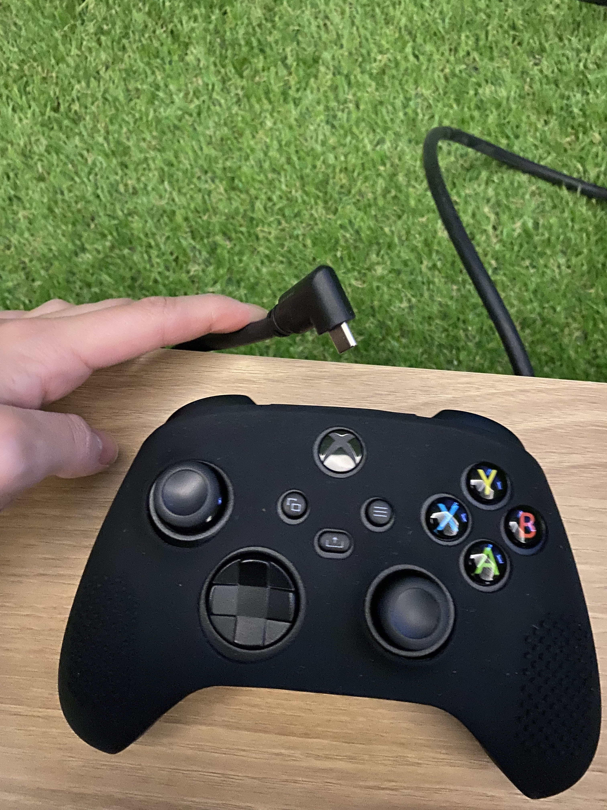

# 을지예술센터 전시장 안내
## 전시 시작: 오전 세팅 방법
- 오전에는 컴퓨터가 절전모드로 되어있을 예정이다. 마우스나 키보드를 클릭해서 컴퓨터를 깨운다. (검정 바탕화면에 앱 아이콘들이 보일 것.)
  - 마우스와 키보드는 블루투스로 연결되어 있다. 사용 시에는 반드시 마우스와 키보드 아래(바닥) 면의 on/off 버튼을 확인한다.
- 화면이 나타나면 작가에게 알린다. 작가가 원격으로 접속해서 플레이 창을 실행한다. 
- 작가의 원격 접속이 끝나도, Team Viewer 알림창이 남아있다. 가장 오른쪽의 OK 버튼을 클릭하면 창이 사라진다.
- 혹시나 작가와 연락이 닿지 않는다면, sosunnyproject.github.io/euljiro.lol 로 접속하면 된다.
- 마우스로 플레이 창을 클릭하고, 새로고침 해준다. 
- 마우스와 키보드 전원을 끄고 서랍 안에 넣는다. 이 때, 마우스나 키보드로 다른 곳을 클릭하지 않도록 주의한다.
- 게임패드로 조작이 되는지 확인하고, 게임패드 버튼으로 새로고침한다.
- 게임패드가 케이블에 연결이 되어있는지, 하얀 불이 들어왔는지 확인한다. 불이 안들어와있으면 한번 눌러서 켜준다.

- 끝.

## 티비 화면이 켜지지 않는 경우
- 만약 티비 화면이 나타나지 않으면, 티비 3대 모두 전원이 초록색으로 들어왔는지 확인한다. 티비가 켜졌으면, hdmi1 신호로 들어간다. 
  - 티비 전원이 빨간색이라면 리모콘으로 동시에 3대를 다시 킨다. 리모콘이 3대에 신호를 동시에 보낸다.
  - 리모콘의 home 버튼 => 방향키로 입력 버튼까지 이동 => OK 클릭 => HDMI 1 선택 
  
  
  - 혹시나 어떤 것은 초록색 어떤 것은 빨강색으로 되면, 아래 잔디 문을 열어서 티비 전원을 모두 껐다가 다시 켜야 한다. 
  - (이름 반대편) 끝에 있는 하얀색과 그 옆에 주황색 스티커로 감싼 코드가 티비 전원이다. 
  

## 플레이 및 사용 안내법
- 게임패드 컨트롤러를 이용한다.

- 오른쪽 동그라미가 초록색이면 로딩이 완료된 것으로, 게임을 시작하면 된다.
- 3분 동안 아무 이동이 없으면, 사람이 없는 것으로 간주되어 새로고침된다. 
- 게임 중간에 튕기거나 이상이 생기면, 게임패드의 새로고침 버튼을 눌러서 다시 시작한다.

# deploying on github
- https://hackernoon.com/publishing-a-threejs-project-on-github-pages-1d1a33dn
- https://www.matteogregoricchio.com/articles/github-pages-hosting-with-parcel 
- `npm start` : when running it locally, delete `dist` folder, and then execute this command
- `npm run deploy` on `main` branch, when deploying to public url
  - on Windows, `rm` command doesn't work. Change it to `del` in `package.json` command
- public url: https://sosunnyproject.github.io/threejs-euljiro/
- add static .glb files to local /dist file after the latest build. No need to push /dist to the github repo.
  - parcel bundler cannot find .glb models is they are located outside of `/dist` when they build.

# Extra library resources
-[PointerLock for First Person Control](https://threejs.org/examples/?q=control#misc_controls_pointerlock)
-[Orbit Controls](https://github.com/mrdoob/three.js/blob/dev/examples/jsm/controls/OrbitControls.js)
- [stats](https://github.com/mrdoob/three.js/blob/dev/examples/jsm/libs/stats.module.js)
- [dat.gui](https://github.com/mrdoob/three.js/blob/dev/examples/jsm/libs/dat.gui.module.js)
- [gamepad test](https://gamepad-tester.com/)
- [gamepad HTML5 API](https://developer.mozilla.org/en-US/docs/Web/API/Gamepad_API/Using_the_Gamepad_API)
- replace mouse-camera orientation with gamepad axis: [stackoverflow](https://stackoverflow.com/questions/18655279/three-js-camera-rotation-order)

# References 
- https://threejs.org/examples/webgl_multiple_views.html
- monstermash.zone
- [notion roadmap](https://www.notion.so/sunny1103/d4dd8d11ba9d4ed09f1ba3d9a713e725?v=4594b4884381414193af44e3856d3fed)
- [multiple scenes tutoria](https://threejsfundamentals.org/threejs/lessons/threejs-multiple-scenes.html)

# Lsystem
- https://gregtatum.com/interactive/2015/growth-incremental-additions/
- https://github.com/FrancescoGradi/L-System-Trees
- https://codepen.io/mikkamikka/pen/ceKpI?editors=0010